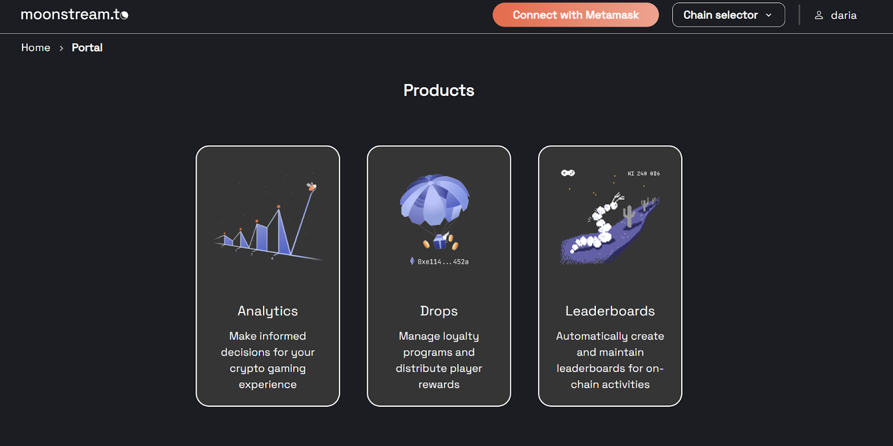
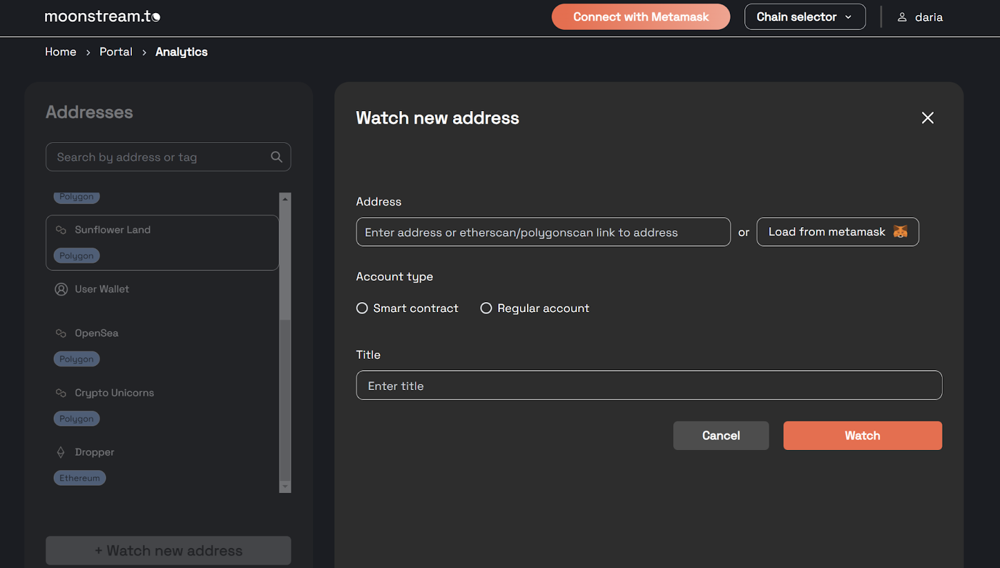
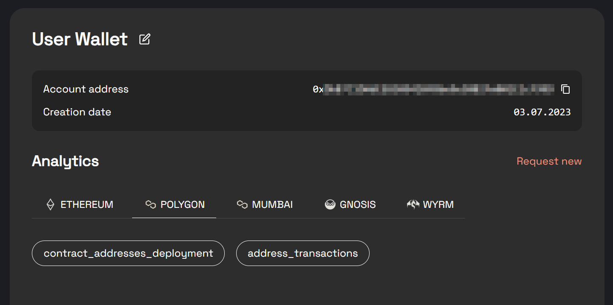
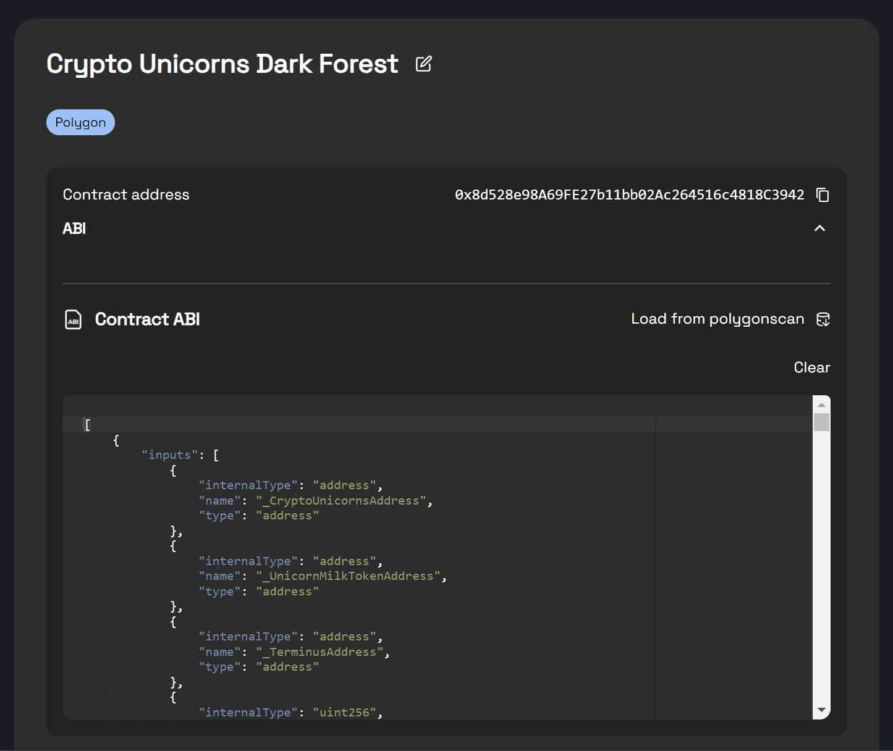
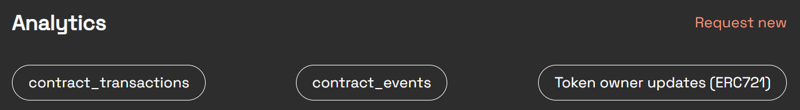
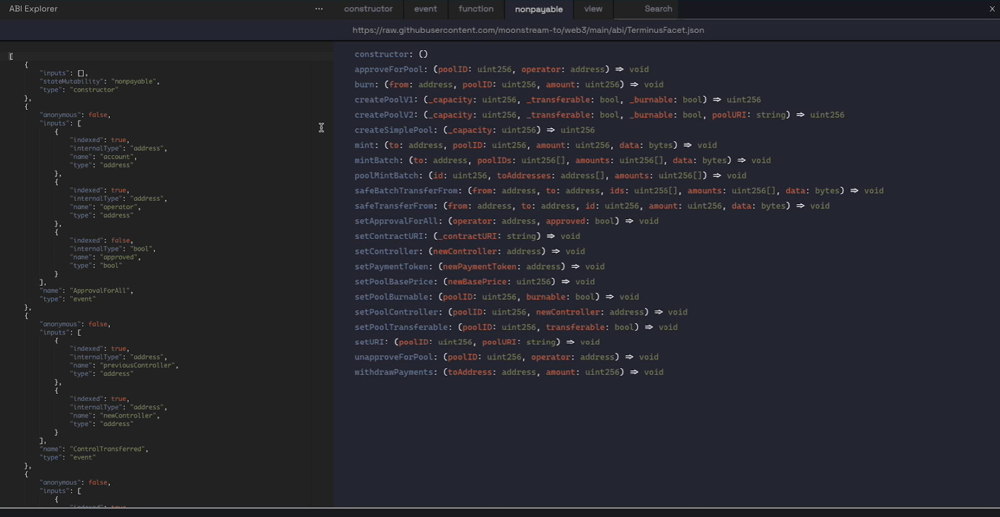

---
tags:
  - api
  - data
---

# Analytics

A highly reliable version of web3 analytics that you can use without connecting your wallet. We run our own nodes, so it’s much better than Etherscan or Polygonscan.

## How to use

First, create a free Moonstream account [here](https://moonstream.to/). Then go to Moonstream [Portal](https://moonstream.to/portal/) and click [Analytics](https://moonstream.to/portal/analytics/).



From there you can create subscriptions to wallet addresses and smart contracts to watch and analyze. This works with live projects or projects that are still under development.



There are two types of subscriptions you can create:

- Regular addresses
- Smart contracts

When you create a subscription to a regular wallet address, we gather all the data associated with it. You can then ask relevant questions about that data, aka make queries about it (e.g. incoming transactions for a particular time period). You can then save the results of your query as a JSON file and use it however you want.



Subscriptions to smart contracts are more complex. You’ll need to provide an ABI, but usually it’s loaded automatically. Once you create a subscription, we begin to gather all the historical data for that smart contract. The types of queries you can make are different for smart contracts, though you can still export the results in JSON format.



All query types are automatically loaded from our library, but you can specify parameters for them. If you want to add another type of query – there’s a button to request it.



# ABI Explorer



To access the ABI Explorer, use this link. This tool offers a comprehensive view of events and functions from your ABI.

Providing the ABI:
1. **Direct ABI Input**: Paste the ABI directly.
2. **From a URL**: Enter the URL of a JSON file containing the ABI. This method archives your input in your session history.
3. **Using a Verified Smart Contract Address**: Simply input the address. Not only is this method stored in your history, but it also pre-fills the function call form for convenience.

💡***Note***: Fetching the ABI using a contract address employs the Moonstream API. A user login is mandatory for this method.

**Function Call with Metamask**: If Metamask is connected, simply click on any function. You can then proceed to fill out the form and initiate the call.

# Query API

Moonstream's Query API makes it possible to query blockchain events, transactions, method calls, and state using SQL queries.

The Query API allows you to make joins across different types of data and get the results in a single step.

Ours is the only API which allows you to join events and transactions to the smart contract state and off-chain metadata.

The production Query API is currently in closed alpha. If you would like to use the Query API, please contact the @moonstream team on the [Moonstream Discord](https://discord.gg/w7wrqrAswq).

## Workflow

To use the Query API, a user must first:

1.  Create a subscription using the Moonstream API

2.  Create a Postgres SQL query that returns the information they want. They can use Postgres variables
    in the query, and pass in values for those variables from the API.

3.  Make an HTTP request

## Moonstream API Usage Examples
### List All Queries
To view all your registered queries, use the following GET request. This helps in managing your queries efficiently.

```
GET <https://api.moonstream.to/queries/list
Authorization: Bearer <Your token>
```

### Create a New Query
To create a new query, use the POST method. This example demonstrates creating a query named "shadowcorns_hatching". It's a powerful feature allowing you to register your custom SQL queries to run against the database.

```
POST <https://api.moonstream.to/queries/
Authorization: Bearer <Your token>
Content-Type: application/json

{
    "name": "shadowcorns_hatching",
    "query": "SELECT label_data->'args'->>'playerWallet' AS address, label_data->'args'->>'tokenId' AS token_id, block_timestamp AS time FROM polygon_labels WHERE address='0xa7D50EE3D7485288107664cf758E877a0D351725' AND label_data->>'type'='event' AND label_data->>'name'='HatchingShadowcornCompleted' ORDER BY block_timestamp DESC"
}
```

### Retrieve a Specific Query
To get the SQL query registered under a specific name, use this GET request. It's useful for retrieving and verifying your existing queries.

```
GET <https://api.moonstream.to/queries/{query_name}/query
Authorization: Bearer <Your token>
Content-Type: application/json
```

### Update an Existing Query
If you need to update a previously created query, use the PUT method as shown. This allows for modifications to your existing queries.

```
PUT <https://api.moonstream.to/queries/{query_name}
Authorization: Bearer <Your token>
Content-Type: application/json

{
    "query": "SELECT label_data->'args'->>'playerWallet' AS address, label_data->'args'->>'tokenId' AS token_id, block_timestamp AS time FROM polygon_labels WHERE address='0xa7D50EE3D7485288107664cf758E877a0D351725' AND label_data->>'type'='event' AND label_data->>'name'='HatchingShadowcornCompleted' ORDER BY block_timestamp DESC"
}
```

### Request Data Update for a Query
To request the latest data based on your query, use this POST method. It's essential for keeping your data up-to-date.

```
POST <https://api.moonstream.to/queries/{query_name}/update_data
Authorization: Bearer <Your token>
Content-Type: application/json

{
    "params": {
    }
}
```

## Working with responses

When you request **update_data** for a query, it responds with an [AWS S3 presigned URL](https://docs.aws.amazon.com/AmazonS3/latest/userguide/ShareObjectPreSignedURL.html) at which you can access the data from an S3 bucket.

**Example response:**
```json
{
  "url": "https://moonstream-queries.s3.amazonaws.com/prod/queries/59a399bc-73ca-4e66-a04a-48ccabce……wMyC1XvhkwL0zpAQEhI%2B9Zf9%2BNkNdIgSKxnt6eyaabE31lX7reSiIpmKjROfvT8HIvysMnXu5qiiq8pyFevw%3D%3D&Expires=1660206971"
}
```

Working with the pre-signed URL:

1. Store a **request_timestamp** before your *update_data* request.
2. POST to **/<query_name>/update_data**, which kicks off a process to dump the data to S3
3. Receive **presigned_url** for s3 access
4. GET **presigned_url** with **If-Modified-Since: request_timetsamp** header. Possible status codes:
    1. **404 -** route is empty, means this was the first time this query was called and data has not been pushed to S3 bucket yet
    2. **304** - data older than **If-Modified-Since** - data is still not updated
    3. **200 -** data is updated, read response, have fun!

> Each time you update the data you overwrite the old S3 object with the new data.

An example Python script to retrieve data from the Query API:

```python
query_name = "current_owners_with_tokens"
moonstream_access_token = "<token>"

request_url = f"https://moonstream.to/queries/{query_name}/update_data"
headers = {
    "Authorization": f"Bearer {moonstream_access_token}",
    "Content-Type": "application/json",
}
request_body = {
    "params": {"address": "0xdC0479CC5BbA033B3e7De9F178607150B3AbCe1f"}
}

keep_going = True

if_modified_since_datetime = datetime.datetime.utcnow()
if_modified_since = if_modified_since_datetime.strftime("%a, %d %b %Y %H:%M:%S GMT")

# Query Moonstream request data update and get presign_url
response = requests.post(
   request_url, json=request_body, headers=headers, timeout=10
)
response_body = response.json()
data_url = response_body["url"] # S3 presign_url
while keep_going:
    data_response = requests.get(
         data_url,
         headers={"If-Modified-Since": if_modified_since},
         timeout=10,
     )
    if data_response.status_code == 200:
        json.dump(data_response.json())
        break
    else:
        # You can put a sleep in here if you want
        continue
```

## Sample data

All data is returned in JSON format. The top-level JSON object contains the following keys:

1. *block_number* - the block number of the most recently crawled block
2. *block_timestamp* - the block timestamp of the most recently crawled block
3. *data* - this is a JSON array containing the data that you care about

### Delete a Query

To remove an existing query from your list, use the DELETE method. This helps in cleaning up old or unused queries.

```
DELETE https://api.moonstream.to/queries/{query_name}
Authorization: Bearer <Your token>
Content-Type: application/json
```
