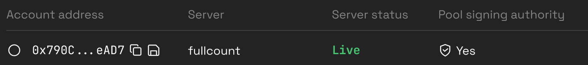

---
tags:
  - api
  - data
  - economics
---

# Drops

Use Drops to distribute ERC20 tokens, NFTs, items, or achievements to your community. All you have to do is upload a spreadsheet listing the amount of rewards that each community member should receive.

Alternatively, you can use Drops to automate the distribution of rewards to players occupying top places in your game’s [leaderboards](leaderboards.md).

## Dropper contract

Dropper is a contract that allows you to distribute tokens to your users, with them submitting the transactions to claim those tokens.

It can distribute ERC20 tokens, ERC721 tokens, and ERC1155 tokens. It can also be used to mint Terminus tokens using an authorized claim workflow.

<table>
  <tr>
    <th>Contract name</th>
    <th>Immutable or Upgradable</th>
    <th>Deployment</th>
    <th>CLI</th>
    <th>Solidity interface</th>
    <th>ABI</th>
  </tr>
  <tr>
    <td><a href="./contracts/Dropper/DropperFacet.sol"><pre>DropperFacet</pre></a></td>
    <td>Upgradable</td>
    <td><pre>web3cli core dropper-gogogo</pre></td>
    <td><pre>web3cli dropper</pre></td>
    <td><a href="./contracts/interfaces/IDropper.sol"><pre>IDropper</pre></a></td>
    <td><a href="./abi/DropperFacet.json"><pre>abi/DropperFacet.json</pre></a></td>
  </tr>
  <tr>
    <td><a href="./contracts/Dropper.sol"><pre>Dropper (legacy version)</pre></a></td>
    <td>Immutable</td>
    <td><pre>web3cli dropper-v1 deploy</pre></td>
    <td><pre>web3cli dropper-v1</pre></td>
    <td>n/a</td>
    <td><a href="./abi/Dropper.json"><pre>abi/Dropper.json</pre></a></td>
  </tr>
</table>

## Workflow

To use drops, you will first have to deploy a Dropper contract. This can be done using the `web3cli` command line utility in [web3 repo](https://github.com/moonstream-to/web3). That's a Python program; instructions to install it are in the [README](https://github.com/moonstream-to/web3/blob/main/README.md).

The command to deploy a Dropper contract is `web3cli core dropper-gogogo`. Try `web3cli core dropper-gogogo –help` to see what parameters you need to provide.

The deployment is complex because we use the [Terminus](../terminus.md) protocol to manage role-based permissions on the Dropper contract. That means you’ll need to also deploy a Terminus contract using `web3cli core terminus-gogogo`. Reach out to us on [Discord](https://discord.gg/w7wrqrAswq) for the details of the deployment from CLI.

We are planning to build a web UI for these deployments in the future.

To manage token drops:
1. Create a free Moonstream account [here](https://moonstream.to/). 
2. Go to Moonstream [Portal](https://moonstream.to/portal/) and click [Drops](https://moonstream.to/portal/dropper/).

# Signing Drops In Portal

## Pre-requisites

Before proceeding with signing drops in the portal, ensure that you have prepared a file in JSON format. This file should adhere to a specific structure with columns:

[ { dropId, claimant, requestID, blockDeadline, amount }]

## Signing Drops via Portal

### Accessing the Portal

Sign in to the Moonstream Portal and navigate to "Drops". Select the dropper contract you intend to manage if it is saved, or enter the address and click show. You will be required to connect your Metamask.

Once you are in the dropper contract, select the pool you wish to sign drops for, then scroll down to the "Claimant" section.

### Choosing the Signing Method

You will encounter two options: "Sign with Server" and "Manual Signing."

#### Sign with Server

For server signing, select "Sign with Server" and choose the appropriate signing server assigned to your account. This will sign the drops and send the signed drops to Moonstream’s Meta Transaction API that you can connect to display the claims to your players.

*If you have no signing server available, contact the Moonstream team on [Discord](https://discord.com/channels/867156607644860418/872202129060810762) to have one created for you.*

#### Understanding Pool Signing Authority

**Token Authorization:** Indicates that the wallet address possesses the signing authorization badge to sign drops in this pool.

If the wallet address has minting authority for the signing badge, you will be shown the option to burn the signing authorization badge.

**Mint Authority Without Signing Authority:** If the wallet address has minting authority for the signing token but no signing authority, you can mint a signing authorization badge to the wallet address.

**No Authority:** If you lack both signing and minting authorities, signing is still possible, but claimant access is restricted until you obtain a signing authorization badge from the contract or pool controller.

#### File Upload and Signing

Upload the prepared drops file and initiate the signing process through the selected server.

### Manual Signing

If opting for manual signing, the process requires a file with two additional columns: 'signer' and 'signature.' To get this file with both columns, use the CLI tool.

# Lootboxes

Before dropping tokens to players, you can bundle them into fully on-chain randomizable lootboxes. These are implemented as [Terminus](../terminus.md) tokens. Lootboxes come in two varieties - deterministic and random.

Random lootboxes use decentralized, verifiable randomness to randomize the items that players receive when they open the lootbox.

<table>
  <tr>
    <th>Contract name</th>
    <th>Immutable or Upgradable</th>
    <th>Deployment</th>
    <th>CLI</th>
    <th>Solidity interface</th>
    <th>ABI</th>
  </tr>
  <tr>
    <td><a href="./contracts/Lootbox.sol"><pre>Lootbox</pre></a></td>
    <td>Immutable</td>
    <td><pre>web3cli lootbox deploy</pre></td>
    <td><pre>web3cli lootbox</pre></td>
    <td><a href="./contracts/interfaces/ILootbox.sol"><pre>ILootbox</pre></a></td>
    <td><a href="./abi/Lootbox.json"><pre>abi/Lootbox.json</pre></a></td>
  </tr>
</table>

Deploying a Lootbox contract can be done using the `web3cli` command line utility in [web3 repo](https://github.com/moonstream-to/web3). That's a Python program; instructions to install it are in the [README](https://github.com/moonstream-to/web3/blob/main/README.md).

