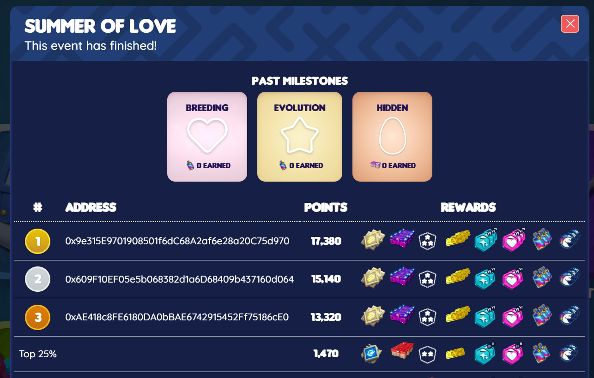
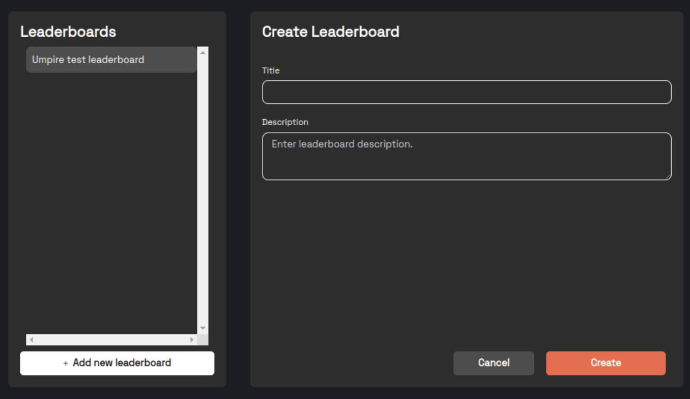
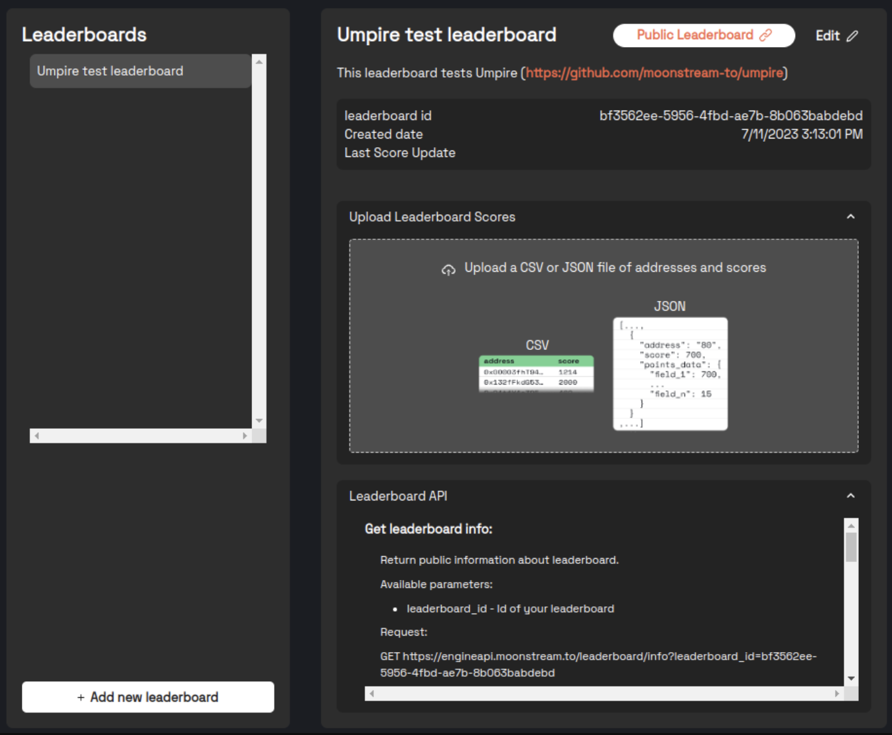

---
tags:
  - api
  - data
  - economics
---

# Leaderboards

Moonstream Leaderboards allow you to create player rankings based on both on-chain and off-chain activity.
You can use [Drops](./drops.md) to reward your players for attaining a high rank on a leaderboard.

This combination of Leaderboards and Drops make it easy to improve the health of your game and your
economy by incentivizing players to engage in entertaining and productive activities.

## Example: Crypto Unicorns Summer of Love

In the Summer of 2022, [Crypto Unicorns](https://cryptounicorns.fun) created a leaderboard
tracking the breeding, hatching, and evolution of Unicorn NFTs. The event was a 3-month long event
powered by Moonstream Leaderboards:

Each of the listed rewards is a [Terminus](../terminus.md) token, distributed via the [Dropper](./drops.md)
contract.

The Summer of Love event led to an almost 100% increase in the number of active unicorns in the game.

## Workflow

Leaderboards are in open beta. We haven't turned on billing for it yet; however, leaderboards with fewer than 100 players on them will always be free.

### Creating and updating a leaderboard

1. Create a free Moonstream account [here](https://moonstream.to/). 
2. Go to Moonstream [Portal](https://moonstream.to/portal/) and click [Leaderboards](https://moonstream.to/portal/leaderboard/).
3. Click on “Add new leaderboard” to create one 

4. The leaderboard view screen will have a section where you can directly upload scores to your leaderboard, and another section explaining how to integrate with the API.

### Automating leaderboard updates

We are currently working on exposing that functionality through our frontend. In the meantime, we can help you set it up. 

For now, you can set up a crawl on some smart contracts and let us know how many points you would like to assign to which events/actions.

When you define a mapping of points to on-chain actions, we run a crawler which generates the total points per player and uploads them to the leaderboard using the same endpoint as "Upload scores CSV''. It's all auto generated.

### Viewing a leaderboard

Integrating a leaderboard into a web frontend or game client is very simple. You can use the Leaderboard
REST API to do this.

Link: [Live Leaderboard API docs](https://engineapi.moonstream.to/leaderboard/docs)

## Implementation

You can view the API implementation of leaderboards in our `web3` repository. The natural entrypoint
is our implementation of the
[`/leaderboard`](https://github.com/moonstream-to/web3/blob/87486652770b11ea146b49a6d3a2934d3384876b/api/engineapi/routes/leaderboard.py)
route.
