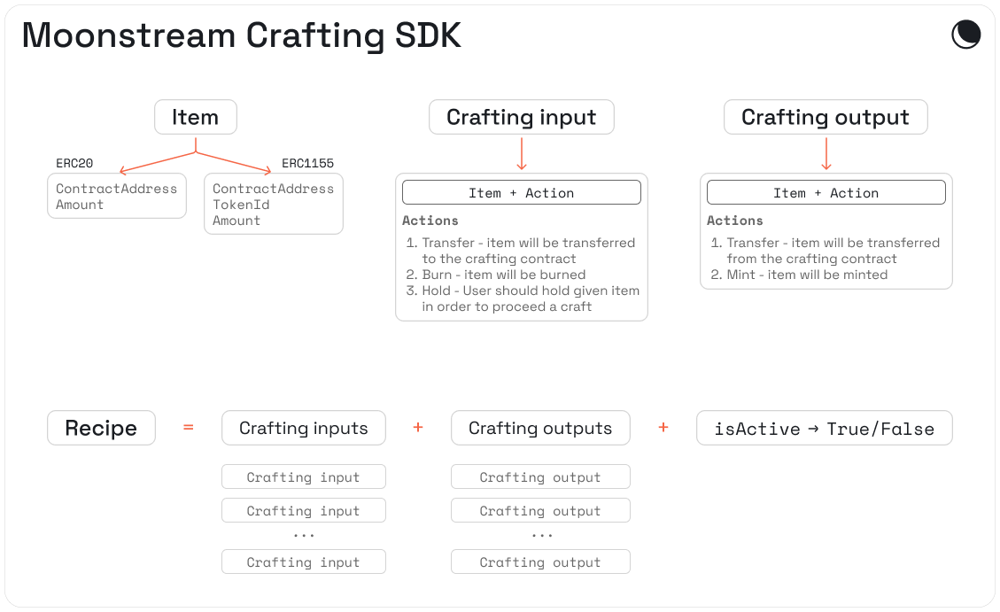

---
tags:
  - tooling
---


# Crafting

A fully on-chain crafting mechanic. Administrators of this contract can create recipes - specifying inputs and outputs.

Players can use those recipes by providing inputs in order to produce outputs.

<table>
  <tr>
    <th>Contract name</th>
    <th>Immutable or Upgradable</th>
    <th>Deployment</th>
    <th>CLI</th>
    <th>Solidity interface</th>
    <th>ABI</th>
  </tr>
  <tr>
    <td><a href="./contracts/crafting/facets/CraftingFacet.sol"><pre>CraftingFacet</pre></a></td>
    <td>Upgradable</td>
    <td><pre>web3cli core crafting-gogogo</pre></td>
    <td><pre>web3cli crafting</pre></td>
    <td><a href="./contracts/interfaces/ICrafting.sol"><pre>ICrafting</pre></a></td>
    <td><a href="./abi/CraftingFacet.json"><pre>abi/CraftingFacet.json</pre></a></td>
  </tr>
</table>

## Moonstream Crafting SDK


### Install

```bash
npm install --save @moonstream/engine
```

### Usage
In this section, we explain:

1. How to import the required modules from `@moonstream/engine`
2. How to instantiate the crafting contract in Javascript code
3. How to view the recipes on an instantiated crafting contract
4. How to create new recipes on an instantiated crafting contract (assuming you have permission).

A full example is available here: [example.ts](https://github.com/moonstream-to/web3/blob/d9c38e7eeb25ea5566d0d3b0aedd880f9c16d585/sdk/src/example.ts)

### Import required modules:

```typescript
import { ethers } from "ethers"
import {
    CraftingRecipe,
    CraftingItem,
    CraftingInputActions,
    CraftingOutputActions,
    CraftingContract,
} from "@moonstream/engine"
```

### Initialize the crafting contract:

```typescript
const provider = new ethers.providers.JsonRpcProvider("RPC_URL")
let craftingAddress = "0x8EA6A5EE9B9f7BCa384D804a12180473Ae4BE297"
let craftingContract = new CraftingContract(
        craftingAddress,
        provider
)
```

### Print all recipes from the contract:

```typescript
let recipesCount = await craftingContract.numRecipes()
console.log(`There are ${recipesCount} recipes on this contract`)
for (let i = 1; i <= recipesCount.toNumber(); ++i) {
    console.log(JSON.stringify(await craftingContract.getRecipe(i)))
    console.log()
}
```

### Creating new recipes:

In order to submit transactions, you will need to initialize wallet provider and connect to the contract:

```typescript
const signer = new ethers.Wallet("PRIVATE_KEY", provider)
craftingContract.connect(signer)
```

Creating crafting items:

```typescript
let emptyBottle: CraftingItem = {
    tokenAddrress: "BOTTLE_ERC1155_ADDRESS",
    amount: "1",
    tokenId: "1",
}

let milk: CraftingItem = {
    tokenAddrress: "MILK ERC20 address",
    amount: "100000000000000000000", // 100 * 10^18, 100 milk
}

let fullBottle: CraftingItem = {
    tokenAddrress: "BOTTLE_ERC1155_ADDRESS",
    amount: "1",
    tokenId: "2",
}
```

We have 3 items: empty bottle, full bottle, and milk (100 units).

Let's make 2 recipes, a bottling milk recipe and an unbottling recipe:

```typescript
let bottlingRecipe: CraftingRecipe = {
    isActive: true,
    craftingInputs: [
        {
            item: emptyBottle,
            action: CraftingInputActions.BURN,
        },
        {
            item: milk,
            action: CraftingInputActions.TRANSFER,
        },
    ],
    craftingOutputs: [
        {
            item: fullBottle,
            action: CraftingOutputActions.MINT,
        },
    ],
}

let unbottlingRecipe: CraftingRecipe = {
    isActive: true,
    craftingInputs: [
        {
            item: fullBottle,
            action: CraftingInputActions.BURN,
        },
    ],
    craftingOutputs: [
        {
            item: emptyBottle,
            action: CraftingOutputActions.MINT,
        },
        {
            item: milk,
            action: CraftingOutputActions.TRANSFER,
        },
    ],
}
```

Let's add these recipes to the contract:

```typescript
console.log("Adding bottling contract")
let recipeId = await craftingContract.addRecipe(bottlingRecipe)
console.log(`Bottling recipe is created with id: ${recipeId}`)

console.log("Adding unbottling contract")
let unbottlingRecipeId = await craftingContract.addRecipe(unbottlingRecipe)
console.log(`Unbottling recipe is created with id: ${unbottlingRecipeId}`)
```

That’s it!